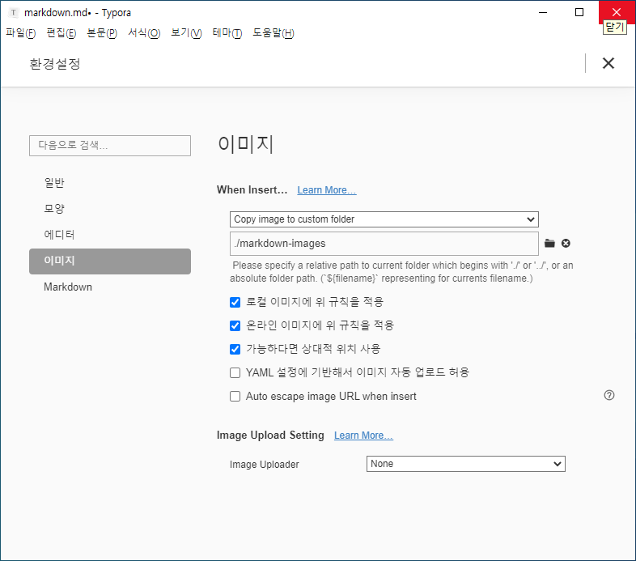

# 마크다운 문법

## 제목(heading)

제목은 `#`로 표현가능하다

### h3

#### h4

##### h5

###### h6

## 목록

* `*`로 순서가 없는 목록 만들 수 있다.
* 엔터를 눌러 탭 제거 가능


1. 순서가 있는 목록도 있다.
2. 허허허허허

## 코드 블록

```python
print('hello')
# 이것은 주석입니다.
```

```html
<!-- 주석 -->
# 주석 아님
<h1>
    안녕
</h1>
```

 

## 링크


외부 URL: [google](http://google.com)

특정 파일의 상대 경로: [README](./README.md)


## 이미지 파일


* 이와 같이 절대경로로 표현하면 GIthub등에서 파일이 존재하지 않아 이미지가 제대로 출력되지 않는다.

* 따라서 typora에 다음과 같은 설정을 해보자

  


## 표

|      |      |      |
| ---- | ---- | ---- |
|      |      |      |
|      |      |      |
|      |      |      |


## 인용문

> 하하
>
> 


## 기타 문법

*이탤릭체*

**굵게 볼드체**

~~취소선~~

`인라인 코드블럭??`


